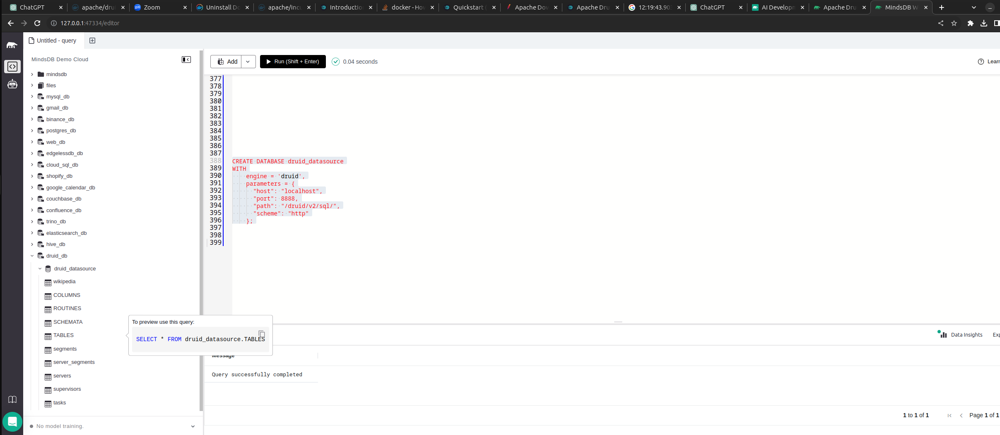
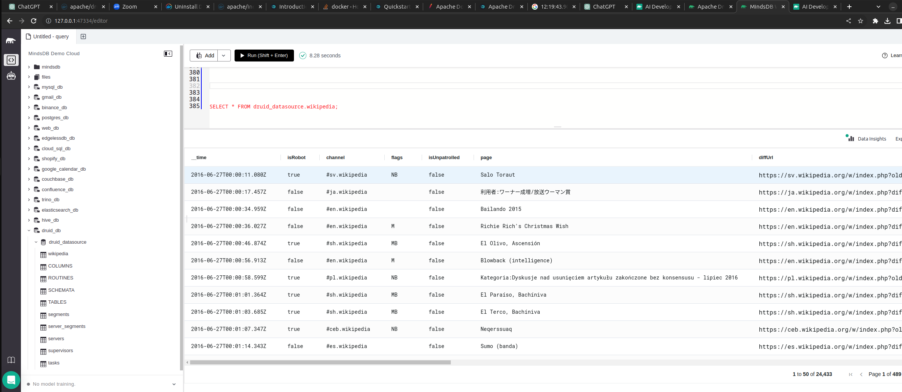
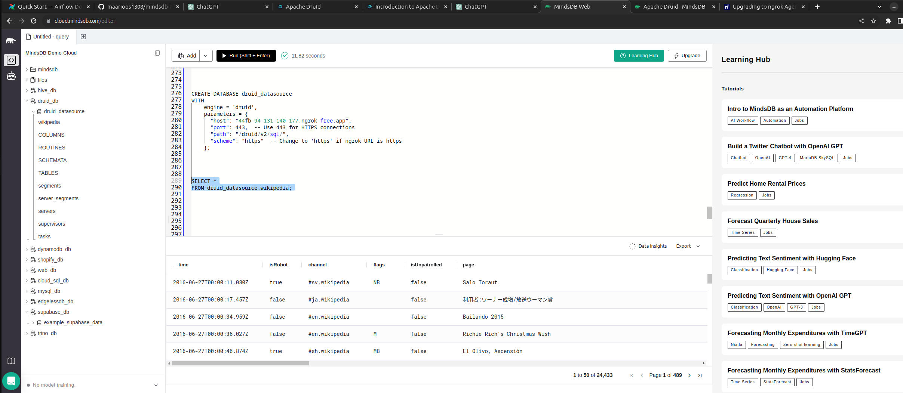

# Welcome to the MindsDB Manual QA Testing for Apache Druid Handler

## Prerequisites

* Apache Druid is installed and running. To do this guide, we will use the [Documentation](https://druid.apache.org/docs/latest/tutorials/) provided by Apache Druid.

## Testing DynamoDB Handler

**1. Testing CREATE DATABASE**

```
CREATE DATABASE druid_datasource
WITH
    engine = 'druid',
    parameters = {
      "host": "localhost",
      "port": 8888,
      "path": "/druid/v2/sql/",
      "scheme": "http"
    };
```




**2. Testing SELECT FROM Database**
    
    ```
    SELECT *
     FROM druid_datasource.wikipedia;
    ```


**3. Testing In Mindsdb Cloud**

```
CREATE DATABASE druid_datasource
WITH
    engine = 'druid',
    parameters = {
      "host": "44fb-94-131-140-177.ngrok-free.app",
      "port": 443,  -- Use 443 for HTTPS connections via ngrok
      "path": "/druid/v2/sql/",
      "scheme": "https"  -- Change to 'https' if ngrok URL is https
    };
```
To do this step, you have to create a tunnel to your local machine using ngrok. To do this, follow the steps below:

1. Create the tunnel using the command below:
```
ngrok http 8082
```
2. Then replace the host with the ngrok URL and the port with 443.




### Results

Drop a remark based on your observation.
- [x] Works Great 💚 (This means that all the steps were executed successfuly and the expected outputs were returned.)
- [ ] There's a Bug 🪲 [Issue Title](URL To the Issue you created) ( This means you encountered a Bug. Please open an issue with all the relevant details with the Bug Issue Template)

---


