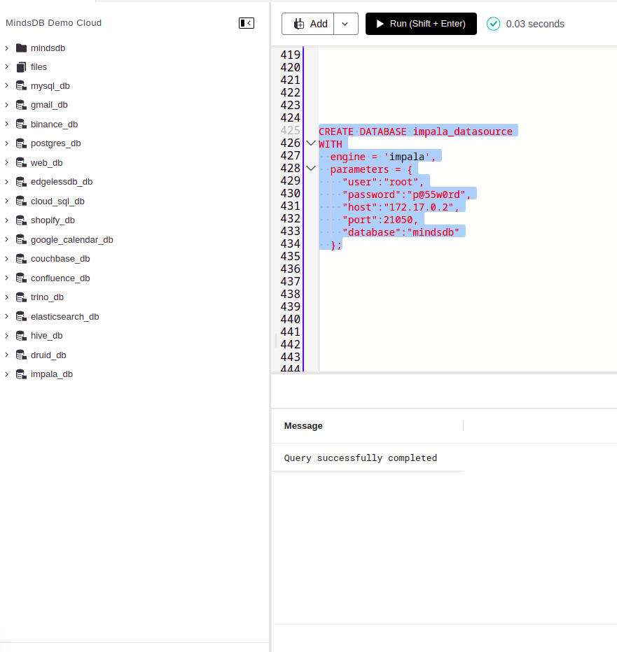
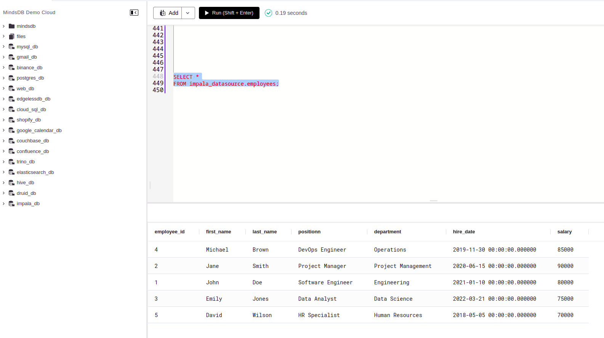
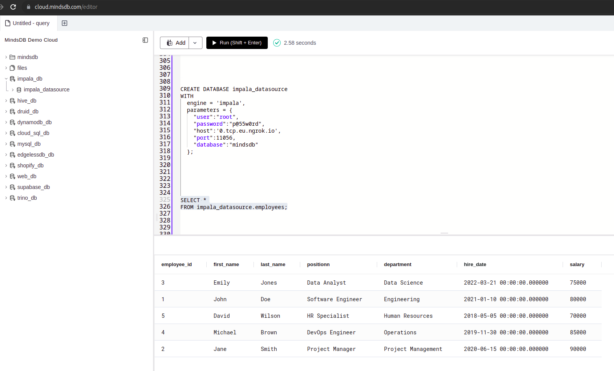

# Welcome to the MindsDB Manual QA Testing for Apache Impala Handler

## Testing Impala Handler

**1. Testing CREATE DATABASE**

```
CREATE DATABASE impala_datasource
WITH
  engine = 'impala',
  parameters = {
    "user":"root",
    "password":"p@55w0rd",
    "host":"172.17.0.2",
    "port":21050,
    "database":"mindsdb"
  };
```




**2. Testing SELECT FROM Database**
    
    ```
    SELECT *
    FROM impala_datasource.employees;
    ```


**3. Testing In Mindsdb Cloud**

```
CREATE DATABASE impala_datasource
WITH
  engine = 'impala',
  parameters = {
    "user":"root",
    "password":"p@55w0rd",
    "host":'0.tcp.eu.ngrok.io',
    "port":11056,
    "database":"mindsdb"
  };

SELECT *
FROM impala_datasource.employees;
```
To do this step, you have to create a tunnel to your local machine using ngrok. To do this, follow the steps below:

1. Create the tunnel using the command below:
```
ngrok tcp 21050
```
2. Then replace the host with the ngrok URL and the port with the port that ngrok creates.




### Results

Drop a remark based on your observation.
- [x] Works Great 💚 (This means that all the steps were executed successfuly and the expected outputs were returned.)
- [ ] There's a Bug 🪲 [Issue Title](URL To the Issue you created) ( This means you encountered a Bug. Please open an issue with all the relevant details with the Bug Issue Template)

---


