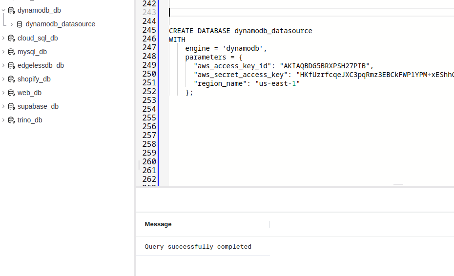
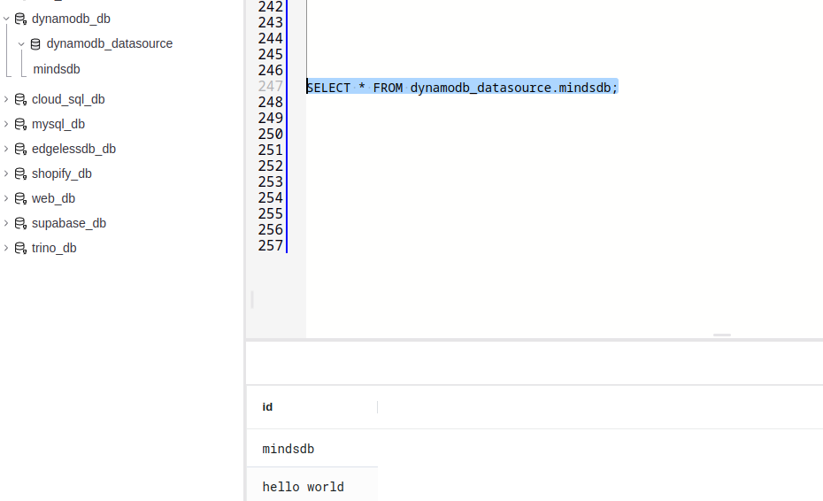

# Welcome to the MindsDB Manual QA Testing for DynamoDB Handler

## Testing DynamoDB Handler

**1. Testing CREATE DATABASE**

```
CREATE DATABASE dynamodb_datasource
WITH
    engine = 'dynamodb',
    parameters = {
      "aws_access_key_id": "MY_KEY_ACCESS_KEY_ID",
      "aws_secret_access_key": "AWS_SECRET_ACCESS_KEY",
      "region_name": "us-east-1"
    };
```




**2. Testing SELECT FROM Database**

```
SELECT * FROM hive_datasource.employees;
```

### Results

Drop a remark based on your observation.
- [x] Works Great 💚 (This means that all the steps were executed successfuly and the expected outputs were returned.)
- [ ] There's a Bug 🪲 [Issue Title](URL To the Issue you created) ( This means you encountered a Bug. Please open an issue with all the relevant details with the Bug Issue Template)

---